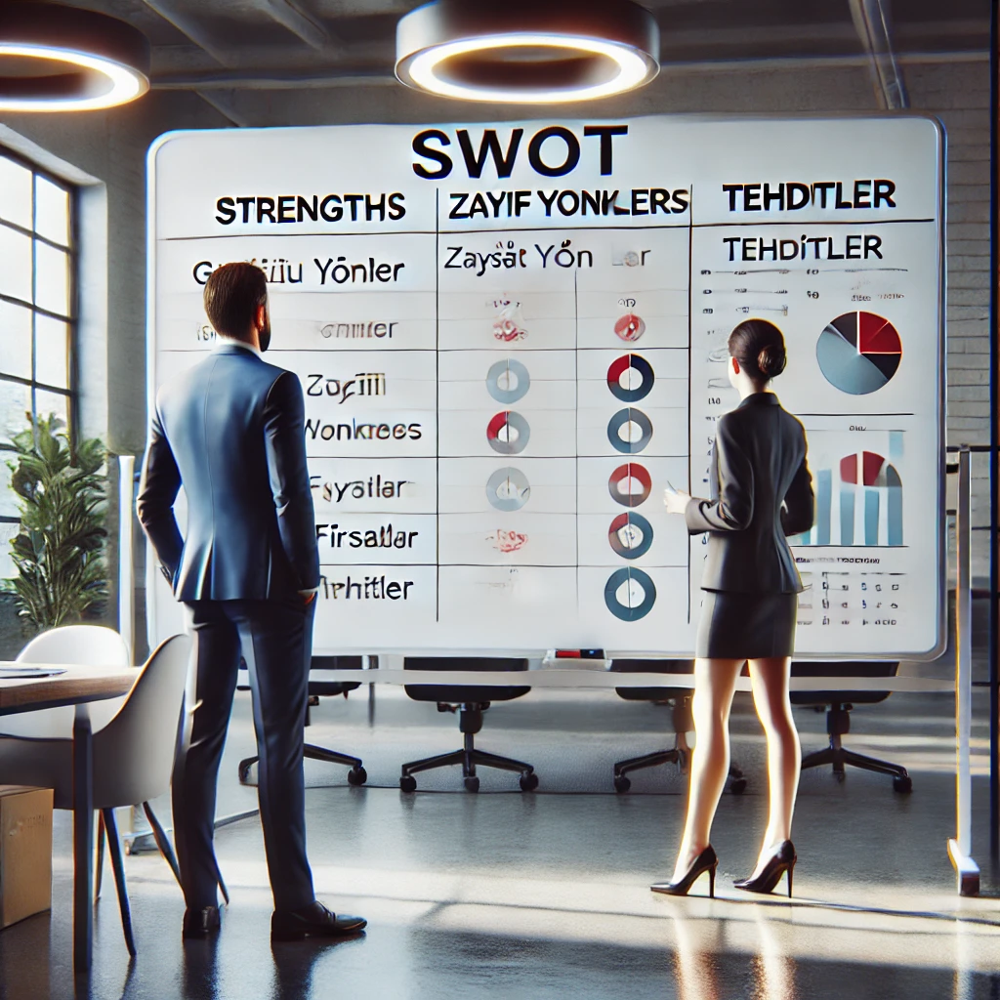
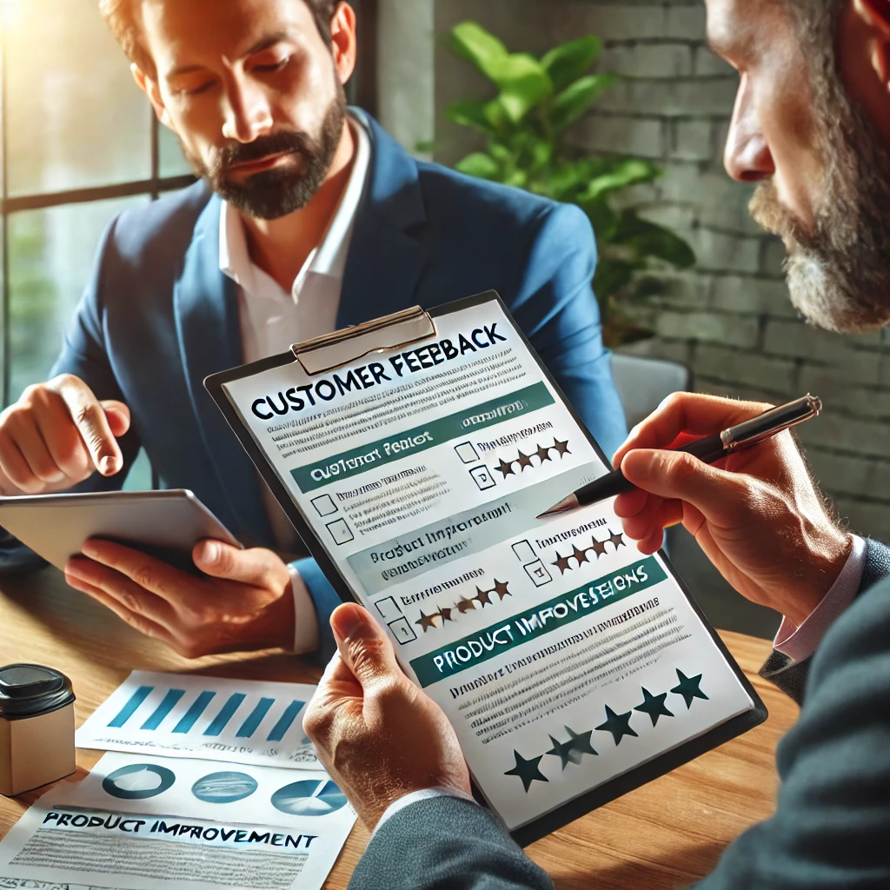

## Dosyaları İndir

- [SUNUM](girisimcilik-sunum.pdf)
- [DÖKÜMAN](pandoc_girisimcilik-sunum.docx)

--- 

<iframe width=700, height=500 frameBorder=0 src="../girisimcilik-sunum.html"></iframe>

---

<!-- paginate: true -->

<!-- _backgroundColor: aquq -->

<!-- _color: orange -->

<!-- paginate: false -->

# KOSGEB Girişimci Destek Programı ile Fikirden Pazara

### **Proje nedir?** → **Neden destek almalısınız?** → **Nasıl başlarsınız?** → **Geliştirin, Büyütün, Ticarileştirin!**

Projeyle işletmenizi büyütmenin adımlarını öğrenin!

 |  |  |  |   

Dr. Uğur CORUH 

- Coruh Arge ve Teknoloji, Genel Müdür
- Recep Tayyip Erdoğan Üni. Bilgisayar Müh. Böl. Dr. Öğr. Üyesi 

---

<!-- _color: orange -->

## 1. Proje Nedir ve Neden Önemlidir?

---

### Soru: Proje nedir?

- **Cevap**: Proje, belirli bir hedefe ulaşmak için yapılan planlı çalışmalardır. İşletmenizi büyütmek, yeni ürünler sunmak veya verimliliği artırmak gibi amaçlar için projeler yapılır.
  
  - Amaç
  - Hedef
  - Plan
  - Eylem
  - Sonuç

---

### Proje Unsurları

- **Proje Amacı**  
  Projenin genel amacı, hedeflenen sorunları çözmek ya da fırsatları değerlendirmektir.

- **Proje Hedefleri**  
  Projenin spesifik ve ölçülebilir sonuçlarıdır.

- **Proje Özgün Değeri**  
  Projenin diğer projelere göre yenilikçi ve özgün özellikleri nelerdir?

---

### Proje Unsurları

- **Proje Süresi**  
  Projenin tahmini başlangıç ve bitiş tarihleri, proje süresi hakkında bilgi sağlar.

- **Proje Takımı**  
  Projeye katkı sağlayan kişilerin rolleri ve uzmanlık alanları.

- **Proje Bütçesi**  
  Projenin maliyeti ve bütçe kalemleri.

---

### Proje Unsurları

- **Proje Yöntem ve Uygulaması**  
  Proje hangi yöntemler ve stratejiler ile gerçekleştirilecek?

- **Proje Çıktıları**  
  Proje tamamlandığında elde edilecek çıktılar ve sonuçlar.

---

### Proje Planı Örneği (Gantt Diyagramı)

---

### Teknoloji Hazırlık Seviyesi

---

### Soru: Proje yapmanın amacı nedir?

- **Cevap**: Projeler, işletmenizi geliştirmek için yeni fırsatlar yaratır. KOSGEB gibi desteklerle projelerinizi finanse edebilir ve işletmenizin büyümesine yardımcı olabilirsiniz.

---

### Örnek:

- **Bir kafe sahibi**: "Kafemi büyütmek istiyorum ama nasıl başlayacağımı bilmiyorum."
  - Çözüm: Proje yaparak yeni ekipman alabilir, KOSGEB desteği ile bunu finanse edebilirsiniz.

---

<!-- _color: orange -->

## Rize'deki Esnaf, Sanaatkar ve Fabrikatörler İçin KOSGEB desteklerine yönelik geliştirilebilecek projeler

---

## 1. Dijitalleşme ve E-Ticaret Projeleri

- **Esnaflar için Dijitalleşme Projeleri:** Esnafların dijital platformlarda yer almasını sağlamak ve online satış yapabilmeleri için e-ticaret projeleri geliştirilebilir. KOSGEB, işletmelere dijital dönüşüm süreçlerinde finansman sağlayabilir.
  
  - E-ticaret sitesi kurulumu ve entegrasyonu
  - Sosyal medya pazarlaması ve dijital reklamcılık
  - Mobil uygulama geliştirme

- **Üreticiler için Dijitalleşme Projeleri:** Fabrikatörlerin üretim süreçlerinde dijital dönüşümünü destekleyen projeler geliştirilebilir. Akıllı üretim, IoT (Nesnelerin İnterneti) tabanlı otomasyon, veri analitiği ve bulut bilişim entegrasyonları üzerine projeler düşünülebilir.

---

## 2. Üretim Kapasitesi Artırma Projeleri

- **Yeni Üretim Hattı Kurulumu ve Modernizasyon:** Fabrikatörlerin üretim kapasitesini artıracak yeni makineler ve ekipmanlar satın almak, üretim hattını modernize etmek ve üretim süreçlerini optimize etmek için projeler geliştirilebilir. KOSGEB’in makine-teçhizat desteğiyle bu projeler hayata geçirilebilir.
  - Esnaf ve küçük üreticiler için küçük ölçekli makinelerle üretim kapasitesini artırma
  - Büyük ölçekli üreticiler için otomasyon sistemleri ve endüstri 4.0 entegrasyonu

---

## 3. Ar-Ge ve Ür-Ge Projeleri

- **Yeni Ürün Geliştirme (Ür-Ge) Projeleri:** Esnaf ve küçük işletmeler için KOSGEB'in Ür-Ge destekleriyle yeni ürünlerin geliştirilmesi üzerine projeler yapılabilir. Bu projeler, yeni ürünlerin prototiplenmesi, test edilmesi ve pazara sunulması aşamalarını kapsar.
- **Araştırma ve Geliştirme (Ar-Ge) Projeleri:** Fabrikatörlerin yeni üretim teknolojileri, malzemeler ve üretim süreçleri üzerine Ar-Ge projeleri geliştirilebilir. KOSGEB’in Ar-Ge projelerine sağladığı destekle yenilikçi ürünler ve süreçler geliştirilip ticari hale getirilebilir.
  - Özellikle mobilya, tekstil, otomotiv yan sanayi gibi sektörlerde inovatif ürün geliştirme projeleri
  - Çevre dostu üretim teknolojileri ve sürdürülebilirlik projeleri

---

## 4. Verimlilik Artırma Projeleri

- **İşletmelerde Verimlilik Artırıcı Teknikler:** Küçük esnaf ve fabrikatörler için, işletme maliyetlerini düşürmek ve üretkenliği artırmak amacıyla verimlilik projeleri geliştirilebilir. KOSGEB verimlilik artışına yönelik destekler sunmaktadır.
  - Enerji verimliliği projeleri
  - İş süreçlerinin optimizasyonu ve stok yönetimi projeleri
  - Kalite yönetim sistemleri entegrasyonu

---

## 5. Pazarlama ve Markalaşma Projeleri

- **Yerel Esnaf ve Küçük İşletmeler için Markalaşma Projeleri:** KOSGEB'in pazarlama destekleri ile esnafların ve küçük işletmelerin markalaşma süreçleri hızlandırılabilir. Kurumsal kimlik geliştirme, marka tanıtımı, online ve offline reklam stratejileri üzerine projeler hazırlanabilir.
  - Yerel ürünlerin paketlenmesi ve markalaştırılması
  - Hedef kitle analizi ve pazarlama stratejileri geliştirme
- **İhracat Odaklı Pazarlama Projeleri:** Fabrikatörler ve büyük üreticiler için yurtdışına açılmayı hedefleyen ihracat odaklı pazarlama projeleri geliştirilebilir. KOSGEB ihracat projelerine finansal destek sağlar.
  - Yurtdışı fuarlara katılım
  - İhracat belgelerinin hazırlanması ve dış pazar araştırması
  - Ürünlerin uluslararası pazarlara tanıtılması

---

## 6. Sosyal Girişimcilik ve Kooperatif Projeleri

- **Esnaf Kooperatiflerinin Güçlendirilmesi:** KOSGEB destekleriyle esnaf kooperatifleri kurularak, küçük esnafın güçlerini birleştirip pazarda daha etkin bir şekilde rekabet etmelerini sağlayacak projeler geliştirilebilir.
  - Kooperatifler aracılığıyla ortak satın alma ve ortak üretim projeleri
  - Kooperatiflerin dijitalleşmesi ve e-ticaret platformlarına entegrasyonu
- **Sosyal Sorumluluk Projeleri:** Esnaf ve küçük işletmeler, sosyal girişimcilik projeleriyle toplumsal kalkınmaya katkıda bulunabilir. KOSGEB sosyal sorumluluk projelerine de destek sağlamaktadır.

---

## 7. Finansal Yönetim ve İstikrar Projeleri

- **Finansal Yönetim ve Planlama Eğitim Projeleri:** Esnaf ve sanatkarlar için finansal yönetim eğitimleri ve bütçe planlaması üzerine projeler geliştirilebilir. KOSGEB'in girişimcilik eğitimleri ile bu projelere destek sağlanabilir.
  - Esnaflar için nakit akışı yönetimi eğitimleri
  - KOBİ'ler için finansal istikrar ve sürdürülebilirlik eğitimleri

---

## 8. İstihdam ve Personel Eğitimi Projeleri

- **Mesleki Eğitim ve Nitelikli İş Gücü Geliştirme:** KOSGEB, esnaflar ve fabrikatörlerin iş gücünü geliştirmeye yönelik eğitim projelerine destek sağlar. Bu kapsamda personel eğitimleri, mesleki gelişim programları ve sertifikasyon projeleri geliştirilebilir.
  - Çıraklık ve usta öğreticilik programları
  - Mesleki yeterlilik belgesi kazandırma projeleri
- **Kapsayıcı İstihdam Projeleri:** Kadınların ve gençlerin iş gücüne kazandırılması amacıyla sosyal sorumluluk kapsamında kapsayıcı istihdam projeleri geliştirilebilir. KOSGEB bu tür projelere destek verir.

---

## 9. Sürdürülebilirlik ve Çevre Dostu Projeler

- **Atık Yönetimi ve Geri Dönüşüm Projeleri:** KOSGEB'in çevre dostu projelere verdiği desteklerle atık yönetimi, geri dönüşüm, çevre dostu üretim teknikleri üzerine projeler geliştirilebilir.
  - Esnaf ve sanatkarlar için atık yönetim sistemlerinin kurulumu
  - Üretim tesislerinde çevre dostu malzeme kullanımı
- **Karbon Ayak İzi Azaltma Projeleri:** Fabrikatörler için enerji verimliliği ve karbon salınımını azaltmaya yönelik projeler geliştirilebilir. Yenilenebilir enerji kaynaklarının kullanımı teşvik edilebilir.

---

## 10. Tedarik Zinciri ve Lojistik Projeleri

- **Tedarik Zincirinin Güçlendirilmesi:** Özellikle üreticiler için tedarik zinciri yönetiminde dijital dönüşüm, lojistik ağlarının iyileştirilmesi ve dağıtım kanallarının güçlendirilmesi üzerine projeler hazırlanabilir.
  - Lojistik otomasyon sistemleri
  - Dijital tedarik zinciri platformları oluşturma
- **Yerel ürünlerin ulusal pazara entegrasyonu:** Esnaf ve küçük üreticilerin ürünlerini daha geniş kitlelere ulaştırmalarını sağlayacak projeler geliştirilerek ulusal dağıtım ağları oluşturulabilir.

---

<!-- _color: orange -->

## İş Planı Örneği

---

## **1. Adım: KOSGEB İş Planı Nedir ve Neden Gerekli?**

- **Nedir?**: KOSGEB'e yapılacak başvurularda istenen iş planı, işletmenizin hedeflerini ve bu hedeflere nasıl ulaşacağınızı gösteren kapsamlı bir belgedir.
- **Neden Gerekli?**: İşletmenizin finansal sağlamlığını göstermek, planlarınızı yatırımcılara ve KOSGEB'e sunabilmek için iş planınız olmalıdır.

#### **Örnek:**

- "Y Gıda Ltd. KOSGEB destek programına başvurarak, 2024'te Türkiye çapında dağıtım yapan bir atıştırmalık markası olmayı hedefliyor."

---

## **2. Adım: Yönetici Özeti**

- **Nedir?**: İş planınızın en üst düzeydeki özeti olup, işinizi ve hedeflerinizi kısaca tanımlar.
- **Neleri İçermeli?**: Şirketin temel değerleri, sunduğunuz ürün/hizmet, hedef kitleniz ve pazar fırsatları.

#### **Örnek:**

- "X Elektronik, Türkiye’de yerli üretimle elektronik cihazlar üreten bir şirkettir. 2024 yılında KOSGEB desteği ile üretim kapasitemizi iki katına çıkarmayı hedefliyoruz."

---

## **3. Adım: Hedef Kitle ve Pazar Analizi**

- **Nedir?**: Ürününüzü/hizmetinizi kime sunduğunuzu ve pazardaki yerinizi tanımlayın.
- **Neleri İçermeli?**: Müşterileriniz kimler, pazar ne kadar büyük, rakipleriniz kimlerdir? KOSGEB bu alandaki detayları görmek ister.

#### **Örnek:**

- "Hedef kitlemiz 18-40 yaş aralığındaki teknoloji meraklılarıdır. Türkiye pazarında Z Elektronik gibi güçlü rakipler bulunmaktadır, ancak yerli üretim avantajımızı kullanarak fark yaratmayı planlıyoruz."

---

## **4. Adım: Ürün veya Hizmetin Tanımlanması**

- **Nedir?**: KOSGEB iş planında sunduğunuz ürün ya da hizmetin tanımı oldukça önemlidir.
- **Neleri İçermeli?**: Ürün/hizmetin müşteri sorunlarına nasıl çözüm sunduğu ve rakiplerden nasıl farklı olduğu.

#### **Örnek:**

- "Ürünümüz, tamamen yerli malzemelerle üretilmiş dayanıklı elektronik cihazlardır. Rakiplerimize kıyasla daha uygun fiyatlı ve uzun ömürlüdür."

---

## **5. Adım: KOSGEB Destekli Pazarlama Stratejisi**

- **Nedir?**: Pazara giriş stratejiniz ve satış kanallarınızın nasıl işleyeceğini detaylandırın.
- **Neleri İçermeli?**: Dijital pazarlama, sosyal medya, reklam kampanyaları, satış kanalları ve KOSGEB'den nasıl faydalanılacağı.

#### **Örnek:**

- "Instagram ve Facebook'ta reklam kampanyaları düzenleyerek ürünümüzü tanıtacağız. Ayrıca KOSGEB'in dijital pazarlama desteklerinden faydalanacağız."

---

## **6. Adım: Üretim ve Lojistik Planı**

- **Nedir?**: KOSGEB'in dikkat edeceği bir diğer önemli konu, işletmenizin üretim ve dağıtım süreçleridir.
- **Neleri İçermeli?**: Üretim süreçleri, stok yönetimi, lojistik ve tedarik zinciri planlaması.

#### **Örnek:**

- "Üretim İzmir'deki fabrikamızda yapılacak ve ürünler Türkiye genelinde anlaşmalı kargo şirketleriyle dağıtılacak. KOSGEB'in üretim teçhizatı desteğinden faydalanarak makine parkımızı genişleteceğiz."

---

## **7. Adım: Finansal Plan ve KOSGEB Destekleri**

- **Nedir?**: İş planınızın bu kısmı, KOSGEB'in sağladığı destekleri nasıl kullanacağınızı ve finansal öngörülerinizi içerir.
- **Neleri İçermeli?**: Gelir projeksiyonları, maliyetler, KOSGEB destekleri, sermaye ihtiyaçları.

#### **Örnek:**

- "2024 yılı için 500.000 TL sermaye yatırımı planlanmıştır. KOSGEB'den alınacak 100.000 TL'lik hibe desteğiyle üretim tesisimizi büyütmeyi hedefliyoruz."

---

## **8. Adım: Riskler ve Çözüm Stratejileri**

- **Nedir?**: Her işte olası riskler vardır ve KOSGEB bu risklere karşı nasıl önlemler aldığınızı bilmek ister.
- **Neleri İçermeli?**: Pazar, finansal ve operasyonel riskler ve bunlara yönelik çözüm önerileri.

#### **Örnek:**

- "Hammadde fiyatlarındaki artış, üretim maliyetlerini yükseltebilir. Alternatif tedarikçiler ile anlaşma yaparak maliyet artışlarını minimize edeceğiz."

---

## **9. Adım: KOSGEB İçin İş Zaman Çizelgesi (Gantt Diyagramı ile)**

- **Nedir?**: İşletmenizin her adımını tarihsel olarak düzenlemeniz gereklidir.
- **Neleri İçermeli?**: Her iş adımının başlama ve bitiş tarihleri, KOSGEB'e teslim edilmesi gereken önemli belgeler ve kilometre taşları.

#### **Örnek:**

- "Mart 2024'te üretim başlayacak, Haziran 2024'te ilk ürünler satışa sunulacak. KOSGEB raporları düzenli olarak her 3 ayda bir teslim edilecek."

---

## **10. Adım: Kısa ve Uzun Vadeli Hedefler**

- **Nedir?**: İşletmenizin hedeflerini KOSGEB’e net ve stratejik bir şekilde iletmelisiniz.
- **Neleri İçermeli?**: Kısa vadeli hedefler (ilk yıl satış hedefleri), uzun vadeli hedefler (genişleme ve büyüme planları).

#### **Örnek:**

- "Kısa vadede Türkiye genelinde 5000 müşteriye ulaşmayı, uzun vadede Avrupa pazarına açılmayı hedefliyoruz. KOSGEB desteği ile teknoloji altyapımızı güçlendireceğiz."

---

### **Sonuç:**

- KOSGEB'e yapılacak iş planı başvurusu, detaylı ve stratejik bir yol haritası ile desteklenmelidir. Bu iş planı rehberini takip ederek, KOSGEB’in sağladığı desteklerden en iyi şekilde yararlanabilir ve işinizi büyütebilirsiniz.

---

<!-- _color: orange -->

## 2. İşletmenizi Nasıl Geliştirebilirsiniz? (Fikirden Projeye)

---

### Soru: İşletmemi nasıl geliştirebilirim?

- **Cevap**: Mevcut işinizi analiz edin. 
  
  - Üretimi artırabilir, 
  - yeni ürünler sunabilir veya daha çok müşteri çekmek için 
  - reklam yapabilirsiniz.

---

### Soru: Fikirlerimi nasıl projeye dönüştürebilirim?

- **Cevap**: İhtiyacınızı belirleyin ve çözüm yollarını düşünün. Örneğin, daha fazla müşteri çekmek için dijital pazarlamaya yatırım yapabilirsiniz.

---

### Örnek:

- **Bir manav**: "Daha fazla müşteriye ulaşmak istiyorum."
  - Çözüm: Proje oluşturup online satışa başlayabilir, KOSGEB desteği ile bir web sitesi kurabilirsiniz.

---

<!-- _color: orange -->

## 3. KOSGEB Destekleri: Neden Başvurmalısınız?

---

### Soru: KOSGEB desteği nedir?

- **Cevap**: KOSGEB, küçük ve orta ölçekli işletmelere maddi destek sağlayan bir kurumdur. İşletmenizi geliştirmek için gereken parayı sağlamak amacıyla projelere başvuru yapabilirsiniz.

---

### Soru: KOSGEB'den neden destek almalıyım?

- **Cevap**: Projelerinizi daha hızlı ve düşük riskle hayata geçirmek için maddi destek alırsınız. Bu destek, yeni makine almak, işyerinizi büyütmek veya pazarlama yapmak için kullanılabilir.

---

### Örnek:

- **Bir terzi**: "Daha fazla sipariş almak istiyorum ama yeni makineler alamıyorum."
  - Çözüm: KOSGEB’e başvurarak makine-teçhizat desteği ile yeni dikiş makineleri alabilirsiniz.

---

<!-- _color: orange -->

## 4. İş Planı Hazırlama: Projenizi Planlayın

---

### Soru: İş planı nedir?

- **Cevap**: İş planı, işletmenizin gelecekte ne yapacağını, nasıl para kazanacağını ve neye ihtiyaç duyduğunu anlatan bir belgedir. KOSGEB destekleri için iş planı gereklidir.

---

### Soru: İş planını nasıl hazırlarım?

- **Cevap**: İşletmenizin ne yapacağını, hangi ürün veya hizmeti sunacağını, kimlere hitap edeceğini ve bu projeyi nasıl gerçekleştireceğinizi yazın.

---

### İş Modeli Tuvali

---

### Örnek:

- **Bir fırın sahibi**: "Yeni fırın makineleri almak istiyorum ama nereden başlayacağımı bilmiyorum."
  - Çözüm: İş planında ihtiyacınız olan makineleri, neden bu yatırımı yapmanız gerektiğini ve bu makinelerin işletmenize nasıl katkı sağlayacağını açıklayın.

---

<!-- _color: orange -->

## 5. Proje Başvuru Süreci: Adım Adım

---

### Soru: KOSGEB’e nasıl başvurabilirim?

- **Cevap**: KOSGEB’e başvuru yapmak için önce girişimcilik eğitimlerine katılmalı, ardından iş planınızı ve başvuru formlarını doldurmalısınız.

---

### Başvuru Adımları:

1. Girişimcilik eğitimini tamamlayın.
2. İş planınızı hazırlayın.
3. KOSGEB'e başvurun.

---

### Örnek:

- **Bir kasap**: "İşyerimi büyütmek için ne yapmam gerekiyor?"
  - Çözüm: Girişimcilik sertifikasını alıp, iş planınızı hazırladıktan sonra KOSGEB’e başvurarak destek alabilirsiniz.

---

<!-- _color: orange -->

## 6. Ar-Ge ve Ür-Ge: Yenilikler Yapmak

---

### Soru: Ar-Ge nedir?

- **Cevap**: Araştırma ve Geliştirme (Ar-Ge), yeni ürünler geliştirmek veya mevcut ürünlerinizi daha iyi hale getirmek için yapılan çalışmalardır. KOSGEB, Ar-Ge projelerini destekler.

---

### Soru: Ür-Ge nedir?

- **Cevap**: Ürün Geliştirme (Ür-Ge), mevcut ürünleri iyileştirerek pazardaki rekabet gücünüzü artırmayı sağlar.

---

### Örnek:

- **Bir şekerci**: "Yeni bir şeker türü geliştirmek istiyorum."
  - Çözüm: Ar-Ge desteği alarak yeni ürününüzü test edin ve geliştirin.

---

<!-- _color: orange -->

## 7. Pazara Giden Yol: Ürünü Satışa Sunma

---

### Soru: Ürünü nasıl pazara sunarım?

- **Cevap**: Ürününüzü pazara sunmak için fiyatlandırma, reklam ve satış kanallarınızı belirlemeniz gerekir. KOSGEB, pazarlama desteği de sağlar.

---

### Örnek:

- **Bir züccaciye**: "Ürünlerimi nasıl daha fazla insana ulaştırabilirim?"
  - Çözüm: KOSGEB pazarlama desteği ile online satış platformlarına giriş yapabilir, dijital reklamlar verebilirsiniz.

---

<!-- _color: orange -->

## 8. Gelişmiş Bilgiler ve Derinlemesine Açıklamalar

### 8.1 SWOT Analizi ile İşletmenizi Değerlendirin

---

#### Soru: İşletmenizin güçlü ve zayıf yönleri neler?

- **Cevap**: Müşteri memnuniyeti yüksek olabilir, ancak dijital altyapınız eksik olabilir.

---

#### SWOT Tablosu:

- **Güçlü Yönler**: Kaliteli ürünler, müşteri sadakati.
- **Zayıf Yönler**: Dijital altyapı eksikliği, yetersiz pazarlama.
- **Fırsatlar**: Online satışa geçiş, yeni müşteri kitlesi.
- **Tehditler**: Artan rakip sayısı, değişen pazar dinamikleri.

---

<!-- _color: orange -->

## 8.2 İş Model Kanvası ile Projenizi Şekillendirin

---

#### Soru: Müşterilere ne sunuyorsunuz? (Değer Önerisi)

- **Cevap**: Yüksek kalite, uygun fiyat, hızlı teslimat gibi müşteriye değer sunabilirsiniz.

---

#### Örnek:

- **Bir e-ticaret firması**: “Hızlı teslimat ve güvenilir alışveriş sunuyoruz.”
  - Çözüm: KOSGEB destekleriyle lojistik altyapınızı geliştirin.

---

<!-- _color: orange -->

## 8.3 Ar-Ge ile Yenilikçi Ürünler ve Teknolojiler Geliştirin

---

#### Ar-Ge Süreci Nedir?

- **Araştırma**: Müşteri talepleri ve teknolojik yenilikler üzerine araştırma yapın.
- **Prototip Geliştirme**: Yeni ürün fikirlerini test edin ve geliştirin.
- **Uygulama**: Ürünlerinizi pazara sunun ve üretim süreçlerini optimize edin.

---

#### KOSGEB Ar-Ge Destekleri

- **Makine-Teçhizat Desteği**: Ar-Ge projelerinde kullanılan ekipmanlar için destek.
- **Personel Desteği**: Ar-Ge projelerine yönelik uzman personel istihdamı.

---

<!-- _color: orange -->

## 8.4 Ür-Ge ile Mevcut Ürünlerinizi Geliştirin

---

#### Ürün Geliştirme (Ür-Ge) Nedir?

- **Cevap**: Ür-Ge, mevcut ürün veya hizmetlerin iyileştirilmesi ve daha rekabetçi hale getirilmesi sürecidir.

---

#### Ür-Ge Aşamaları

- **Müşteri Geri Bildirimleri**: Ürünlerinizi geliştirmek için müşterilerden gelen geri bildirimleri dikkate alın.
- **İyileştirme ve Yeniden Tasarım**: Ürünlerinizde kaliteyi artıracak geliştirmeler yapın.

---

<!-- _color: orange -->

## 8.5 SWOT ve İş Model Kanvasını Entegre Edin

---

#### Soru: SWOT ve İş Model Kanvası nasıl kullanılır?

- **Cevap**: SWOT ile işletmenizin güçlü ve zayıf yönlerini analiz edin, İş Model Kanvası ile iş planınızı stratejik bir çerçevede oluşturun.

---

#### Örnek:

- **Bir gıda üreticisi**: “Üretim kapasitemizi artırırken maliyetleri nasıl kontrol altında tutabilirim?”
  - Çözüm: SWOT analizi ile maliyetleri belirleyin, iş model kanvası ile yeni gelir akışlarını planlayın.

---

<!-- _color: orange -->

## 9. Teşekkürler!

#### Soru ve Cevap Bölümü

- Projeler hakkında sorularınızı sorun.
- Daha fazla bilgi: [kosgeb.gov.tr](https://www.kosgeb.gov.tr)
- Sıkça Sorular Sorular Sayfasını İnceleyebilirsiniz 
  - https://www.kosgeb.gov.tr/Web/Genel/SSS.aspx?KatID=2
- Girişimci Destek Programı 
  - https://www.kosgeb.gov.tr/site/tr/genel/destekdetay/1231/girisimci-destek-programi
- Ticaret odalarından danışmanlık ve destek alabilirsiniz.

---

<!-- paginate: true -->

<!-- _backgroundColor: aquq -->

<!-- _color: orange -->

<!-- paginate: false -->

# KOSGEB Girişimci Destek Programı ile Fikirden Pazara

 |  |  |  |   

Dr. Uğur CORUH 

- Coruh Arge ve Teknoloji, Genel Müdür 
  - (ugur.coruh@coruh.com.tr)
- Recep Tayyip Erdoğan Üni. Bilgisayar Müh. Böl. Dr. Öğr. Üyesi 
  - (ugur.coruh@erdogan.edu.tr) 
