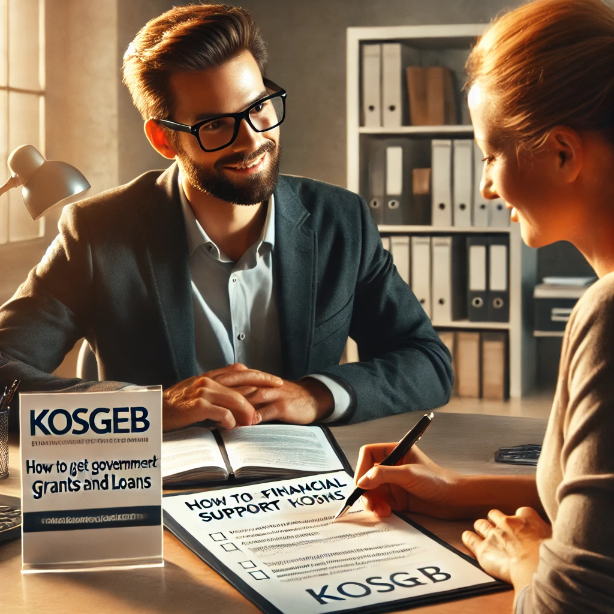
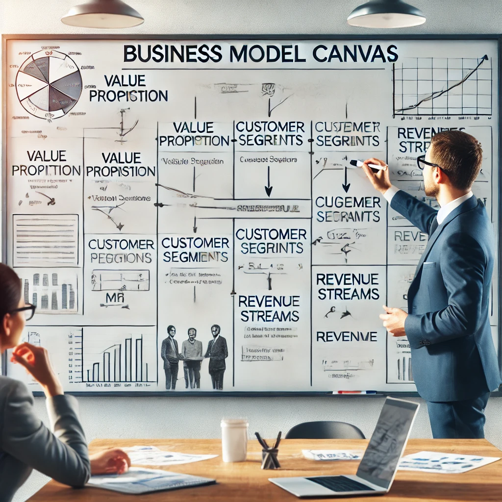

{align=center}

\newpage

## Dosyaları İndir

- [PDF SUNUM](girisimcilik-giris.marp.pdf)
- [PPTX SUNUM](girisimcilik-giris.marp.pptx)
- [PDF DÖKÜMAN](girisimcilik-giris.pandoc.pdf)
- [WORD DÖKÜMAN](girisimcilik-giris.pandoc.docx)

\newpage

# KOSGEB Destek Programları ile Fikirden Pazara

### **Proje nedir?** → **Nasıl Destek Alınır?** → **Nasıl başlarsınız?** → **Geliştirin, Büyütün, Ticarileştirin!**

**Projeyle işletmenizi büyütmenin adımlarını öğrenin!**

{height=100px}
{height=100px}
{height=100px}
{height=80px}
{height=80px}

#### **Dr. Uğur CORUH** 

- **Coruh Arge ve Teknoloji, Genel Müdür**
- **Recep Tayyip Erdoğan Üni. Bilgisayar Müh. Böl. Dr. Öğr. Üyesi** 

\newpage

### **Proje Nedir ve Neden Önemlidir?**

{width=300px align=center}

Proje, belirli bir hedefe ulaşmak için yapılan planlı çalışmalardır. İşletmenizi büyütmek, yeni ürünler sunmak veya verimliliği artırmak gibi amaçlar için projeler yapılır.
  
  - Amaç
  - Hedef
  - Plan
  - Eylem
  - Sonuç

\newpage

### **Proje Unsurları**

{width=300px align=center}

- **Proje Amacı**  
  Projenin genel amacı, hedeflenen sorunları çözmek ya da fırsatları değerlendirmektir.

- **Proje Hedefleri**  
  Projenin spesifik ve ölçülebilir sonuçlarıdır.

- **Projenin Yenilikçi Yönü**  
  Projenin diğer projelere göre yenilikçi ve özgün özellikleri nelerdir?

- **Proje Süresi**  
  Projenin tahmini başlangıç ve bitiş tarihleri, proje süresi hakkında bilgi sağlar.

- **Proje Personeli**  
  Projeye katkı sağlayan kişilerin rolleri ve uzmanlık alanları.

- **Proje Bütçesi**  
  Projenin maliyeti ve bütçe kalemleri.

- **Proje Yöntem ve Uygulaması**  
  Proje hangi yöntemler ve stratejiler ile gerçekleştirilecek?

- **Proje Çıktıları**  
  Proje tamamlandığında elde edilecek çıktılar ve sonuçlar.

\newpage

### **Proje yapmanın amacı nedir?**

{width=300px align=center}

- Projeler, işletmenizi geliştirmek için yeni fırsatlar yaratır. 
- KOSGEB destekleriyle projelerinizi finanse edebilir ve işletmenizin büyümesine yardımcı olabilirsiniz.

### **İşletmemi nasıl geliştirebilirim?**

{width=300px align=center}

- Mevcut İşinizi Analiz Edin İhtiyacınızı belirleyin
- Çözüm yollarını düşünün,
- Üretimi artırabilir, 
- Yeni ürünler sunabilir
- Daha çok müşteri çekmek için  Reklam yapabilirsiniz.

\newpage

### **KOSGEB Nedir?**

{width=300px align=center}

- KOSGEB, küçük ve orta ölçekli işletmelere destek sağlayan bir kurumdur. 
- Türkiye'de KOBİ'ler ile ilgili en etkin kurumdur.
- KOBİ'lerin ihracattaki payını artırmayı hedefler,
- KOBİ'lerin İstihdama katkılarını artırmayı amaçlar,
- İşletmenizi geliştirmek için gereken finansmanı sağlamak amacıyla projelere başvuru yapabilirsiniz.

### **KOSGEB Desteğinin İşletmelere Faydaları Nelerdir?**

{width=300px align=center}

- Projelerinizi daha hızlı ve düşük riskle hayata geçirmek için maddi destek alırsınız. 
- Bu destek, 
  - yeni makine almak, 
  - işyerinizi büyütmek veya 
  - pazarlama yapmak için kullanılabilir.

### **KOSGEB’e nasıl başvurabilirim?**

{width=300px align=center}

- KOSGEB Veritabanına Kayıt Olunuz
- Kayıtlı iseniz Beyannamenizi Güncelleyiniz
- Başvuracağınız Destek Programı İle İlgili Bilgi Alınız
- Tüm Başvurular wwww.kosgeb.gov.tr üzerinden elektronik ortamda yapılmaktadır.

\newpage

###  **İş planı nedir?**

{width=300px align=center}

İş planı, 
- işletmenizin gelecekte ne yapacağını, 
- nasıl gelir elde edeceğini ve 
- neye ihtiyaç duyduğunu anlatan bir belgedir. 

KOSGEB destekleri için iş planı gereklidir.

### **İş planını nasıl hazırlarım?**

{width=300px align=center}

- İşletmenizin ne yapacağını, 
- hangi ürün veya hizmeti sunacağını, 
- kimlere hitap edeceğini ve bu 
- projeyi nasıl gerçekleştireceğinizi yazın.

\newpage

### **İş Planı (Proje Bilgi) Dökümanını Doldurunuz**

- KOSGEB tarafından girişimcilere verilen desteklerin genel çerçevesini tanımlar.

### **İşletmeye İlişkin Bilgiler**
- Ünvanı
- Vergi numarası
- Ortakları
- Organizasyon şeması ve personel sayıları ve dağılımı
- Üretim yeri ve üretim tesisi bilgileri
- Üretim alanı
- Üretim yeri
- Diğer kurum kuruluşlara verdiği projeler ve aldığı teşvik ve yardımlar

### **İşletme Makine Parkuru**
- Makine/Teçhizat Adı
- Adet
- Yerli/İthal
- Özellikleri

### **Proje Konusu Ürüne İlişkin Bilgiler**

- Proje konusu ürünün tanıtımı.

### **Proje Konusu Ürüne İlişkin Dış Ticaret Verileri**
- Son 3 Yıl
  - İthalat Tutarı (USD)
  - İhracat Tutarı (USD)
  - Dış Ticaret Açığı (USD)

### **Ürüne İlişkin Yurtiçi – Yurtdışı Pazar Büyüklüğü**
- Son 3 Yıl
  - Yurt İçi Pazar Büyüklüğü (Toplam Satışlar USD)
  - Yurt Dışı Pazar Büyüklüğü (Toplam Satışlar USD)
  - Yurt İçi Talep Miktarı (Adet)
  - Yurt İçi Arz Miktarı (Adet)
  - Yurt Dışı Talep Miktarı (Adet)
  - Yurt Dışı Arz Miktarı (Adet)
  - Sektör Küresel Büyümesi (%)

### **Ürüne-Muadiline İlişkin İhracat ve İthalat Bilgileri**
- Son 3 Yıl
  - Ürüne İlişkin İthalat (USD)
  - Muadiline İlişkin İthalat (USD)
  - Ürüne İlişkin İhracat (USD)
  - Muadiline İlişkin İhracat (USD)

### **Rakip Firmalar**
- Rakip Firma Adı
- Pazar Payı (%)
- Üstün Yönleri
- Zayıf Yönleri

### **Mevcut ve Potansiyel Müşteriler ile Talepleri**
- Müşteri Bilgileri
- Öngörülen Müşteri Talepleri

### **Üretim-Satış Planı**

Üretim-satış planı, işletmenin belirli bir dönem içinde üretim ve satış hedeflerini içeren önemli bir belgedir. Bu plan:

- Üretilecek ürünlerin maliyetlerini,
- Yurt içi ve yurt dışı satış fiyatlarını,
- Öngörülen yurt içi ve yurt dışı satış miktarlarını,
- Beklenen toplam satış gelirlerini,
- Toplam maliyetleri,
- Beklenen kârı içerir.

Bu bilgiler, işletmenin üretim kapasitesini ve pazarlama stratejisini belirlemede önemli bir rol oynar.

### **Yatırımın Geri Dönüş Süresi**

Yatırımın geri dönüş süresi, yapılan yatırımın ne kadar sürede geri kazanılacağını gösterir. Bu süreyi etkileyen faktörler şunlardır:

- Beklenen kâr,
- Amortisman giderleri,
- Toplam maliyet ve gelir,
- İndirgenme oranı ve bugünkü değer,
- Yatırımın tutarı ve geri dönüş süresi,
- Başabaş noktası (gelirlerin, yatırım maliyetlerini karşılayarak ne zaman eşitleneceğini gösterir).

### **İşletmenin Tarihçesi, Mevcut Faaliyetleri, Ortakları ve Proje Deneyimleri**
- İşletmenin tarihçesi
- Mevcut faaliyetleri kapsamında ürettiği ürün/ürün grupları
- Proje deneyimleri ile işletme sahibi/ortaklarının geçmiş deneyimleri, eğitimleri ve yürüttüğü faaliyetler
- Başvuru yapan işletme dışında ortak olduğu firmaların adı ve vergi numaraları

### **Proje Konusu ile İlgili Mevcut Durum**
- Proje konusuyla ilgili işletmenin mevcut faaliyetleri
- İhtiyaçların mevcut durumda nasıl karşılandığı
- Diğer çalışmalar

### **Projenin Amacı ve Gerekçesi**
- Projeye hangi nedenlerle ihtiyaç duyulduğu
- Proje hazırlığı ve teknik fizibilite çalışmaları kapsamında yapılanlar
- Proje ile nelerin amaçlandığı

### **Projenin Konusu**
- Proje kapsamında gerçekleştirilecek faaliyetler
- Proje ile işletmenin:
  - Üretim/hizmet sunum kapasitesi
  - Ürün/hizmet çeşitliliği
  - Teknoloji düzeyi
  - Teknik bilgi gelişimi
  - İhracat potansiyeli
  - İnsan kaynağı niteliği gibi konulara etkisi
- Proje çıktısının sektörde karşıladığı çözümler
- Başka sektörde uygulanabilirliği

### **Projenin Hedef ve Faaliyetleri**
- Proje hedef ve faaliyetlerinin aşağıdaki hedef kartları ile açıklanması gerekmektedir.
- Her bir hedef altında:
  - İlgili hedefe ulaşmak için yürütülecek faaliyetler
  - Faaliyetlerin çıktıları maddeler halinde listelenerek
  - Her bir hedefle ilgili proje giderleri gerekçeleriyle birlikte anlatılacaktır.
- Bu bölüme yazılan faaliyet isimleri “3.1 Faaliyet - Zaman Planı” bölümündeki faaliyet isimleri ile aynı olacaktır.

### **Projenin Hedeflere, Pazara ve Rekabet Durumuna Etkisi**
- İşletmenin orta ve uzun dönemli hedefleri
- Projenin bu hedeflere ulaşmada ne şekilde katkı sağlayacağı
- Projenin:
  - İşletmenin pazar payına
  - Pazar genişliğine etkisi
  - Proje yerinin lojistik açıdan uygunluğu

### **Riskler, Önlemler ve Varsayımlar**
- Projenin uygulanma sürecinde ve sonrasında karşılaşılabilecek muhtemel riskler
- Bunlara ilişkin alınacak önlemler
- Proje uygulama sürecine olumlu etkisi olabilecek hususlar (varsayımlar)

### **Projede Kullanılacak İşletme Kaynakları**
- Projede kullanılmak üzere:
  - İşletmenin sahip olduğu personel
  - Makine benzeri kaynaklar
  - Proje sürecinde kendi imkanları ile gerçekleştireceği giderler
  - Bunların projeye olan katkısı

### **Proje Yönetimi**
- Proje Yöneticisi ile işletme yöneticileri ve ilgili birimler arasında:
  - Proje konusundaki iletişim ve koordinasyonun nasıl sağlanacağı
  - Proje ilerleyişi ile ilgili gözden geçirme sistematiği
  - KOSGEB proje izleme süreçlerine ilişkin görev dağılımı
- Proje Yöneticisi değişikliği durumunda proje yönetiminde aksama olmayacak şekilde kurgu oluşturulmalıdır.

### **Sürdürülebilirlik**
- Proje tamamlandıktan sonra projenin beklenen sonuçlarının sürdürülebilirliğinin nasıl sağlanacağı
- Hem kurumsal hem mali açıdan sürdürülebilirlik açıklaması

\newpage

### **İş Modeli Tuvali**

{align=center}

\newpage

### **SWOT Analizi ile İşletmenizi Değerlendirin**

{width=300px align=center}

- İşletmenizin güçlü ve zayıf yönleri neler?
- Müşteri memnuniyeti yüksek olabilir, ancak dijital altyapınız eksik olabilir.

SWOT ile işletmenizin güçlü ve zayıf yönlerini analiz edin, İş Model Kanvası ile iş planınızı stratejik bir çerçevede oluşturun.

\newpage

#### **SWOT Tablosu**

{width=300px align=center}

- **Güçlü Yönler**: Kaliteli ürünler, müşteri sadakati.
- **Zayıf Yönler**: Dijital altyapı eksikliği, yetersiz pazarlama.
- **Fırsatlar**: Online satışa geçiş, yeni müşteri kitlesi.
- **Tehditler**: Artan rakip sayısı, değişen pazar dinamikleri.

\newpage

# KOSGEB Destek Programları ile Fikirden Pazara

{height=100px}
{height=100px}
{height=100px}
{height=80px}
{height=80px}

- Daha fazla bilgi: [kosgeb.gov.tr](https://www.kosgeb.gov.tr)
- Sıkça Sorular Sorular Sayfasını İnceleyebilirsiniz 
  - https://www.kosgeb.gov.tr/Web/Genel/SSS.aspx?KatID=2
- Ticaret odalarından danışmanlık ve destek alabilirsiniz.

#### **Dr. Uğur CORUH** 
- **Coruh Arge ve Teknoloji, Genel Müdür** 
- (ugur.coruh[*]coruh.com.tr)
- **Recep Tayyip Erdoğan Üni. Bilgisayar Müh. Böl. Dr. Öğr. Üyesi** 
- (ugur.coruh[*]erdogan.edu.tr) 

\newpage

{ align=center}

