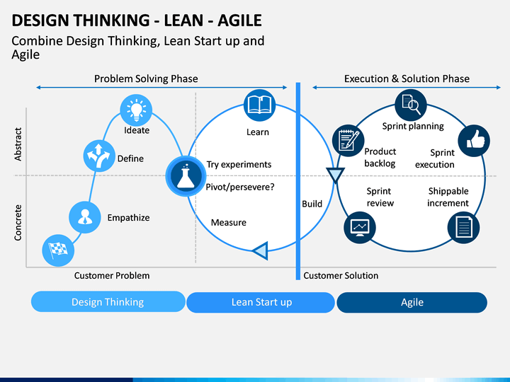

# Workshop Sunumu

## RTEÜ Sanayi 4.0 & Dijital Dönüşüm Workshop

<div style="text-align: center; margin: 2rem 0;">
  
</div>

---

## Sunum Formatları

Workshop sunumunu farklı formatlarda görüntüleyin:

<div class="grid cards" markdown>

-   **PowerPoint Sunumu**

    ---

    Orijinal PowerPoint dosyasını indirin

    [:fontawesome-solid-download: İndir (PPTX)](../../rteu-sanayi40-dijital-donusum-workshop-2025.pptx){ .md-button .md-button--primary }

    - 62 slayt
    - Progress bar'lı
    - Tam ekran görseller

-   **İnteraktif HTML Sunum**

    ---

    Marp ile oluşturulmuş web sunumu

    [:fontawesome-solid-presentation-screen: Görüntüle](slides.html){ .md-button }

    - Tarayıcıda açılır
    - Klavye ile navigasyon
    - Responsive tasarım

-   **Markdown Kaynak**

    ---

    Sunum kaynak kodları

    [:fontawesome-solid-code: MkDocs](slides.md){ .md-button }
    [:fontawesome-solid-code: Marp](slides.marp.md){ .md-button }

    - Düzenlenebilir
    - Versiyon kontrolü kolay

</div>

---

## Sunum Bilgileri

| Özellik | Değer |
|---------|-------|
| **Tarih** | 19 Ekim 2025, Pazar |
| **Saat** | 10:00 - 12:00 (2 saat) |
| **Eğitmen** | Dr. Öğr. Üyesi Uğur CORUH |
| **Katılımcı** | 50 Öğrenci → 25 Proje |
| **Toplam Slayt** | 62 |
| **Format** | PPTX, HTML, Markdown |

---

## Program Akışı

| Zaman | Konu | Süre |
|-------|------|------|
| 10:00-10:10 | Açılış & Tanışma | 10 dk |
| 10:10-10:30 | Sanayi 4.0 & Dijital Dönüşüm | 20 dk |
| 10:30-10:55 | Modern Araçlar + CANLI DEMO | 25 dk |
| 10:55-11:20 | Fonlama Ekosistemi | 25 dk |
| 11:20-11:30 | MOLA + Hazırlık | 10 dk |
| 11:30-12:00 | HANDS-ON ATÖLYE | 30 dk |

---

## İnteraktif HTML Sunum

!!! example "Marp Sunumu - Tam Ekran Görüntüleme"

    <div style="border: 3px solid #0f3460; border-radius: 12px; overflow: hidden; margin: 1.5rem 0; box-shadow: 0 10px 40px rgba(0,0,0,0.3); background: #1a1a2e;">
      <div style="background: linear-gradient(135deg, #0f3460 0%, #16213e 100%); padding: 15px; color: white; font-weight: bold; text-align: center;">
        📊 Workshop Sunumu - Interaktif Görünüm
      </div>
      <iframe src="slides.html" width="100%" height="600px" frameborder="0" allowfullscreen style="display: block; background: white;"></iframe>
    </div>

    <div style="text-align: center; margin: 1.5rem 0;">
      <a href="slides.html" target="_blank" class="md-button md-button--primary" style="margin: 0 5px;">
        🖥️ Tam Ekranda Aç
      </a>
      <a href="slides.marp.md" class="md-button" style="margin: 0 5px;">
        📄 Marp Kaynak Kodu
      </a>
    </div>

    **Klavye Kısayolları:**

    - `→` / `Space`: Sonraki slayt
    - `←`: Önceki slayt
    - `F`: Tam ekran
    - `Esc`: Tam ekrandan çık

---

## Klavye Kısayolları

HTML sunum için:

| Tuş | İşlev |
|-----|-------|
| **→** veya **Space** | Sonraki slayt |
| **←** | Önceki slayt |
| **F** | Tam ekran |
| **Esc** | Tam ekrandan çık |
| **Home** | İlk slayt |
| **End** | Son slayt |

---

## Sunum İçeriği

### Bölüm 1: Açılış (6 slayt)
- Ana başlık
- Konuşmacı tanıtımı
- Program akışı
- Öğrenme hedefleri
- Beklentiler yönetimi

### Bölüm 2: Sanayi 4.0 (10 slayt)
- Endüstri 4.0 tarihi
- Temel teknolojiler (IoT, AI, Cloud, Big Data)
- Türkiye'de Sanayi 4.0
- Başarı örnekleri

### Bölüm 3: AI Araçları (12 slayt)
- AI neden gerekli?
- Claude & Claude Code
- ChatGPT & Gemini
- GitHub Copilot
- Prompt Engineering

### Bölüm 4: Fonlama (8 slayt)
- Genel bakış
- TÜBİTAK 2209-A
- KOSGEB AR-GE
- Teknofest
- Uluslararası fonlar

### Bölüm 5: Mola & Hazırlık (2 slayt)
- Takım numaraları
- Hesap kurulumları

### Bölüm 6: Atölye (19 slayt)
- Design Thinking - Lean - Agile
- Takım oluşturma
- Problem seçimi
- Proje önerisi formatı
- Araştırma yöntemleri
- Proje şablonları

### Bölüm 7: Kapanış (4 slayt)
- Video anlatımı
- Sonraki adımlar
- Kaynaklar ve linkler
- İletişim bilgileri

---

## Kaynaklar

- [PowerPoint Kodu](../../rteu_ultimate_presentation.py)
- [Workshop Genel Bakış](../workshop/overview.md)
- [GitHub Repository](https://github.com/ucoruh/rteu-sanayi-dijital-donusum)

---

!!! tip "Sunumu Kendiniz Oluşturun"
    ```bash
    python rteu_ultimate_presentation.py
    ```

    Gerekli kütüphaneler:
    ```bash
    pip install python-pptx requests Pillow
    ```
