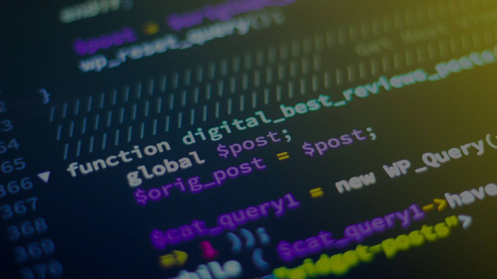

<!-- Slide 1 -->

# 1/62

- SANAYİDE DİJİTAL DÖNÜŞÜM
- AI Araçlarıyla Fikirden Ürüne

---

<!-- Slide 2 -->

# 2/62

- Dr. Öğr. Üyesi Uğur CORUH
- RTEÜ Erasmus+ 19 Ekim 2025, Pazar 10:00 - 12:00 50 Öğrenci → 25 Proje

---

<!-- Slide 3 -->

# 3/62

- 📅 BUGÜNÜN PROGRAMI
- 10:00-10:10 | Açılış & Tanışma
- 10:10-10:30 | Sanayi 4.0 & Dijital Dönüşüm
- 10:30-10:55 | Modern Araçlar + CANLI DEMO
- 10:55-11:20 | Fonlama Ekosistemi
- 11:20-11:30 | MOLA + Hazırlık
- 11:30-12:00 | HANDS-ON ATÖLYE

---

<!-- Slide 4 -->

# 4/62

- ⏰ 10:03
- 📚 BUGÜN NE ÖĞRENECEKSİNİZ?
- 🏭 Sanayi 4.0 Temelleri
- 8 temel teknoloji: IoT, AI, Big Data, Cloud, Dijital İkiz, Robotik, 3D Print, AR/VR
- 🤖 AI Araçları Kullanımı
- Claude, ChatGPT, Gemini ile proje geliştirme, DeepResearch ile literatür tarama
- 💰 Fonlama Fırsatları
- TÜBİTAK 2209-A (7.5K TL), KOSGEB (600K TL), Horizon Europe ve başvuru formatları
- 📝 Proje Yazım Teknikleri
- TÜBİTAK formatı, 9 bölümlü proposal şablonu, AI ile otomatik döküman üretimi
- 🎯 Problem-Çözüm Metodolojisi
- Gerçek sanayi sorunlarını belirleme, uygulanabilir çözümler geliştirme
- 🚀 Hızlı Prototipleme
- AI yardımıyla 30 dakikada fikir → proje önerisi → pitch hazırlama
- 🎤 1 Dakikalık Pitch
- Problem-Çözüm-Etki formatında etkili sunum yapma becerileri
- 🤝 Takım Çalışması & Networking
- İkili takımlar, peer feedback (3-2-1 metodu), mentörlük deneyimi

---

<!-- Slide 5 -->

# 5/62

- ⏰ 10:05
- 🎯 BUGÜNÜN HEDEFLERİ
- Sanayi 4.0 Farkındalığı
- ✓ 8 temel teknolojiyi tanımak ve örneklemek
- AI Araçları Yetkinliği
- ✓ En az 3 farklı AI aracını aktif kullanabilmek
- Fonlama Bilgisi
- ✓ Minimum 5 fon kaynağını ve başvuru süreçlerini bilmek
- Proje Önerisi Oluşturma
- ✓ TÜBİTAK formatında 1 tam proje önerisi hazırlamak
- Ekip İşbirliği & Pitch
- ✓ 1 dakikalık profesyonel pitch sunumu yapabilmek

---

<!-- Slide 6 -->

# 6/62

- ⏰ 10:07
- 🤔 BEKLENTİLER vs GERÇEKLİK
- ❌ "AI her şeyi yapar, biz hiçbir şey öğrenmeyiz"
- ✅ AI yardımcıdır - Siz yönlendirir, kontrol eder, öğrenirsiniz
- ❌ "Proje yazmak aylar sürer, çok zordur"
- ✅ AI ile 30-60 dakikada ilk taslak, 1 haftada tamamlanır
- ❌ "Fonlar sadece büyük şirketler ve deneyimlilere"
- ✅ TÜBİTAK 2209-A sadece öğrencilere, KOSGEB herkese açık
- ❌ "Sanayi 4.0 sadece mühendislik içindir"
- ✅ Tüm sektörlere uygulanabilir: Sağlık, tarım, eğitim, perakende...
- ❌ "Bugün sadece teori, uygulama yok"
- ✅ 30 dakika hands-on atölye, kendi projenizi oluşturacaksınız!

---

<!-- Slide 7 -->

# 7/62

- ⏰ 10:10-10:30
- SANAYİDE DİJİTAL DÖNÜŞÜM NEDEN?
- 92%
- Şirketler dönüşüm planlıyor
- 37%
- Başarıyla uyguluyor
- 3.5X
- Verimlilik potansiyeli

---

<!-- Slide 8 -->

# 8/62

- ⏰ 10:15
- 🏭 SANAYİ 4.0: 8 TEKNOLOJI
- 🔗 IoT: Akıllı sensörler, gerçek zamanlı veri
- 🧠 AI/ML: Tahmin, optimizasyon, otomasyon
- 📊 Big Data: Veri analitiği, pattern bulma
- ☁️ Cloud: Sınırsız kaynak, her yerden erişim
- 🔄 Dijital İkiz: Siber-fiziksel sistemler
- 🤖 Robotik: Otonom robotlar, cobots
- 🖨️ 3D Print: Hızlı prototipleme
- 🥽 AR/VR: Bakım, eğitim, montaj desteği

---

<!-- Slide 9 -->

# 9/62

- ⏰ 10:12
- 🏭 SANAYİ 4.0 NEDİR?
- Üretim süreçlerinin dijitalleşmesi, otomasyon ve veri alışverişini içeren dördüncü sanayi devrimi. Fiziksel ve dijital sistemlerin birleşimi ile akıllı fabrikalar oluşturulur.
- Bağlantılılık
- Makineler, cihazlar ve sistemler birbirine bağlı
- Gerçek Zamanlı Veri
- Anlık izleme ve analiz ile hızlı karar alma
- Otomasyon
- İnsan müdahalesi olmadan çalışan sistemler
- Yapay Zeka
- Öğrenen ve kendini geliştiren akıllı sistemler

---

<!-- Slide 10 -->

# 10/62

- ⏰ 10:14
- 📜 4 SANAYİ DEVRİMİ
- 1.0
- 1784
- Buhar Makinesi
- Mekanik üretim, su ve buhar gücü
- 2.0
- 1870
- Elektrik
- Seri üretim, montaj hattı, elektrik enerjisi
- 3.0
- 1969
- Bilgisayar & Otomasyon
- Dijital devrim, PLC, robotlar
- 4.0
- 2011
- Siber-Fiziksel Sistemler
- IoT, AI, Big Data, Cloud, akıllı fabrikalar

---

<!-- Slide 11 -->

# 11/62

- ⏰ 10:16
- 🔗 IoT - Nesnelerin İnterneti
- Fiziksel cihazların internet üzerinden veri toplaması ve paylaşması
- 📡 Akıllı Sensörler: Sıcaklık, nem, titreşim, basınç sensörleri
- 🏭 Üretim Hattı İzleme: Makine performansı, enerji tüketimi
- 📦 Lojistik Takibi: RFID etiketleri, GPS izleme
- ⚡ Predictive Maintenance: Arıza öncesi uyarı sistemleri
- ✨ FAYDA: 💰 %25-30 bakım maliyeti düşüşü, %70 daha az beklenmedik duruş

---

<!-- Slide 12 -->

# 12/62

- ⏰ 10:18
- 🧠 AI/ML - Yapay Zeka & Makine Öğrenmesi
- Sistemlerin veriden öğrenerek karar alması ve sürekli gelişmesi
- 🔍 Kalite Kontrol: Görüntü işleme ile hatalı ürün tespiti
- 📈 Talep Tahmini: Satış verilerinden üretim planlaması
- 🤖 Süreç Optimizasyonu: En verimli üretim parametrelerini bulma
- 🎯 Enerji Yönetimi: Akıllı enerji tüketim optimizasyonu
- ✨ FAYDA: 🚀 %20-35 üretim verimliliği artışı, %99.9 kalite oranı

---

<!-- Slide 13 -->

# 13/62

- ⏰ 10:20
- 📊 Big Data - Büyük Veri Analitiği
- Büyük hacimli verinin toplanması, depolanması ve analiz edilmesi
- 📉 Üretim Analitiği: Çevrim süresi, fire oranı, OEE metrikleri
- 🔬 Kalite Analitiği: Hata pattern analizi, root cause analysis
- 🌐 Tedarik Zinciri: Envanter optimizasyonu, risk analizi
- 👥 Müşteri Analitiği: Talep tahminleme, personalizasyon
- ✨ FAYDA: 📊 Karar alma hızında %5X artış, %15-20 maliyet düşüşü

---

<!-- Slide 14 -->

# 14/62

- ⏰ 10:22
- ☁️ Cloud Computing - Bulut Bilişim
- İnternet üzerinden esnek ve ölçeklenebilir bilişim kaynakları
- 💾 Veri Depolama: Sınırsız depolama, otomatik yedekleme
- ⚙️ Uygulama Hosting: ERP, MES, PLM sistemleri bulutta
- 🔐 Güvenli Erişim: Her yerden, her cihazdan güvenli bağlantı
- 📡 IoT Platform: Milyonlarca cihazdan veri toplama
- ✨ FAYDA: 💸 %30-40 IT altyapı maliyeti düşüşü, sonsuz ölçeklenebilirlik

---

<!-- Slide 15 -->

# 15/62

- ⏰ 10:24
- 🔄 Dijital İkiz (Digital Twin)
- Fiziksel varlıkların sanal ortamda birebir dijital kopyası
- 🏭 Fabrika Simülasyonu: Üretim hattını sanal ortamda test
- 🔧 Ürün Geliştirme: Prototip öncesi sanal testler
- 📐 Süreç Optimizasyonu: "What-if" senaryoları simülasyonu
- 🎓 Eğitim: Risk almadan güvenli öğrenme ortamı
- ✨ FAYDA: ⚡ %50 daha hızlı ürün geliştirme, %75 test maliyeti düşüşü

---

<!-- Slide 16 -->

# 16/62

- ⏰ 10:26
- 🤖 Robotik & Otomasyon
- Otonom ve yarı-otonom sistemlerle üretim süreçlerinin otomasyonu
- 🦾 Endüstriyel Robotlar: Kaynak, boyama, montaj robotları
- 🤝 Cobotlar (Collaborative): İnsanlarla yan yana çalışan robotlar
- 🚛 AGV/AMR: Otonom taşıma araçları, akıllı depolar
- 🎯 RPA: Ofis süreçlerinin otomasyonu (fatura, sipariş)
- ✨ FAYDA: ⏱️ %24/7 kesintisiz üretim, %60 daha yüksek hassasiyet

---

<!-- Slide 17 -->

# 17/62

- ⏰ 10:28
- 🇹🇷 TÜRKİYE'DE SANAYİ 4.0
- Dijital Dönüşüm Hazırlığı
- 52/100
- → Avrupa 28. sıra
- Sanayi 4.0 Yatırımı
- $2.5B
- → 2020-2024 arası
- Robot Yoğunluğu
- 22/10K
- → Çalışan başına (Dünya ort: 85)
- Hedef 2030
- Top 10
- → Akıllı üretim endeksi
- 🎯 PROGRAMLAR: Sanayi 4.0 Dönüşüm Programı, Dijital Türkiye 2023, Milli Teknoloji Hamlesi, KOSGEB Dijital Dönüşüm Desteği

---

<!-- Slide 18 -->

# 18/62

- ⏰ 10:30-10:55
- 🛠️ MODERN PROJE ARAÇLARI
- Cursor • Claude Code • Claude • Gemini • ChatGPT • PlantUML • DrawIO • Python

---

<!-- Slide 19 -->

# 19/62

- ⏰ 10:32
- 🤖 CLAUDE EKOSİSTEMİ
- Claude (chat)
- → Brainstorm, araştırma, problem çözme
- Claude Projects
- → Custom instructions, döküman yükleme, proje yönetimi
- Claude Code
- → Kod yazma, debugging, refactoring
- DeepResearch
- → Kapsamlı literatür taraması, patent araştırması

---

<!-- Slide 20 -->

# 20/62

- ⏰ 10:40
- 💻 GELİŞTİRME ARAÇLARI
- Cursor
- → AI pair programming, otomatik kod tamamlama
- GitHub Copilot
- → Kod önerileri, test yazımı
- GitHub
- → Versiyon kontrol, CI/CD, collaboration
- VS Code
- → Code editor, extensions, terminal

---

<!-- Slide 21 -->

# 21/62

- ⏰ 10:48
- 🎨 DİYAGRAM & DÖKÜMAN
- PlantUML
- → UML diyagramları, kod ile diagram
- DrawIO
- → Akış diyagramları, mimari şemaları
- Python-docx
- → Otomatik Word dökümanı
- Python-pptx
- → Otomatik PowerPoint sunumu

---

<!-- Slide 22 -->

# 22/62

- ⏰ 10:52
- 🔍 ARAŞTIRMA & YARDIMCI
- ChatGPT
- → Alternatif bakış açısı, yaratıcı fikirler
- Gemini
- → Google entegrasyonu, multimodal analiz
- Perplexity
- → Güncel bilgi, kaynak araştırması
- Python
- → Otomasyon, veri işleme, web scraping

---

<!-- Slide 23 -->

# 23/62

- ⏰ 10:53
- 🎬 CANLI DEMO
- Claude ile 5 dakikada proje önerisi

---

<!-- Slide 24 -->

# 24/62

- ⏰ 10:42
- 🤔 AI ARAÇLARI NEDEN GEREKLİ?
- Hız
- 100X daha hızlı kod yazma, 10 dakikada proje önerisi
- Doğruluk
- Syntax hataları yok, best practice kodlama
- Öğrenme
- Yeni diller/framework'leri anında öğrenme
- Yaratıcılık
- Farklı yaklaşımlar, alternatif çözümler
- 24/7 Asistan
- Gece 3'te bile yardım alabilen AI pair programmer
- Demokratizasyon
- Herkes kod yazabilir, herkes proje geliştirebilir

---

<!-- Slide 25 -->

# 25/62

- ⏰ 10:44
- 🎯 AI KULLANIM SENARYOLARI
- Proje Fikri Bulma
- ❌ 2-3 hafta beyin fırtınası
- ✅ 30 dakika Claude ile
- 💰 %95 zaman
- Literatür Taraması
- ❌ 1-2 hafta manuel araştırma
- ✅ 1 saat DeepResearch
- 💰 %90 zaman
- Kod Yazımı
- ❌ 40 sat/hafta manuel kodlama
- ✅ 10 sat/hafta AI ile
- 💰 %75 zaman
- Dokümantasyon
- ❌ 1 hafta Word'de yazma
- ✅ 2 saat python-docx
- 💰 %85 zaman
- Sunum Hazırlama
- ❌ 2 gün PowerPoint
- ✅ 1 saat python-pptx
- 💰 %90 zaman

---

<!-- Slide 26 -->

# 26/62

- ⏰ 10:46
- 🔄 AI İLE PROJE GELİŞTİRME AKIM
- İdea
- 🔧 Claude Chat
- Beyin fırtınası, problem tanımlama
- Research
- 🔧 DeepResearch
- Literatür tarama, patent araştırma
- Plan
- 🔧 Claude Projects
- Proje outline, görev dağılımı
- Code
- 🔧 Cursor/Claude Code
- Kod yazma, debugging, refactoring
- Document
- 🔧 Python-docx
- Otomatik Word/PDF döküman
- Present
- 🔧 Python-pptx
- Otomatik PowerPoint sunumu
- Deploy
- 🔧 GitHub + CI/CD
- Versiyon kontrol, otomatik deploy

---

<!-- Slide 27 -->

# 27/62

- ⏰ 10:48
- 🎬 DEMO HAZIRLIĞI
- ✅ Claude hesabı açın (claude.ai - ücretsiz)
- ✅ Örnek problem hazırlayın: "Fabrikada enerji israfı"
- ✅ Prompt şablonu: "TÜBİTAK 2209-A formatında proje önerisi yaz"
- ✅ İzleyicilere göstereceğiniz ekranı hazırlayın
- ✅ 5 dakika süre tutun - hız önemli!

---

<!-- Slide 28 -->

# 28/62

- ⏰ 10:50
- ⭐ AI KULLANIM İPUÇLARI
- ✅ Spesifik olun
- ❌ Belirsiz sorular
- 💡 "Python Flask API yaz" yerine "Flask REST API, JWT auth, SQLite DB"
- ✅ Bağlam verin
- ❌ Tek satır prompt
- 💡 Projenin amacını, kullanıcı tipini, kısıtlamaları belirtin
- ✅ İteratif çalışın
- ❌ İlk çıktıyı kabul edin
- 💡 "Şunu ekle, bunu değiştir" diyerek geliştirin
- ✅ Doğrulayın
- ❌ Kör güven
- 💡 AI'ın verdiği kodu test edin, anlamadığınızı sorun
- ✅ Versiyon kontrolü
- ❌ Sadece kopyala-yapıştır
- 💡 Git kullanın, her değişikliği commit edin

---

<!-- Slide 29 -->

# 29/62

- ⏰ 10:52
- ⚖️ AI ARAÇLARI KARŞILAŞTIRMA
- Claude
- ✅ En uzun context (200K), Projects
- ❌ Kod çalıştıramaz
- 🎯 En iyi: Araştırma, yazma
- ChatGPT
- ✅ Plugin ekosistemi, DALL-E entegre
- ❌ Kısa context (128K)
- 🎯 En iyi: Genel amaçlı
- Gemini
- ✅ Google entegrasyonu, ücretsiz
- ❌ Kod kalitesi düşük
- 🎯 En iyi: Hızlı sorular
- Cursor
- ✅ IDE entegre, kod tamamlama
- ❌ Ücretli ($20/ay)
- 🎯 En iyi: Yazılım geliştirme
- Claude Code
- ✅ Terminal komutları, dosya edit
- ❌ Beta aşaması
- 🎯 En iyi: Full-stack projeler

---

<!-- Slide 30 -->

# 30/62

- ⏰ 10:55-11:20
- 💰 FONLAMA EKOSİSTEMİ

---

<!-- Slide 31 -->

# 31/62

- ⏰ 10:58
- 🇹🇷 TÜRKİYE FONLARI
- TÜBİTAK 2209-A
- 💵 7.500 TL • ⏱️ 12 ay
- Öğrenci projeleri, mentor gerekli
- KOSGEB Ar-Ge
- 💵 600K TL • ⏱️ 24 ay
- Girişimler, %75 hibe, prototip
- Teknofest
- 💵 100K TL • ⏱️ 8 ay
- 40+ kategori, prototip zorunlu
- TÜBİTAK 1512
- 💵 750K TL • ⏱️ 18 ay
- Teknogirişim, 500K hibe

---

<!-- Slide 32 -->

# 32/62

- ⏰ 11:08
- 🌍 ULUSLARARASI FONLAR
- EU Horizon
- 💶 1-10M EUR
- Konsorsiyum gerekli, TRL 3-9
- Erasmus+ KA2
- 💶 60-450K EUR
- Eğitim ortaklıkları, 2-3 yıl
- EIC Accelerator
- 💶 2.5M EUR
- Deep-tech startups, equity

---

<!-- Slide 33 -->

# 33/62

- ⏰ 11:10
- 🎯 FONLAMA NEDEN ÖNEMLİ?
- Kaynak Sağlar
- Prototip, ekipman, yazılım lisansları, danışmanlık hizmetleri
- Hızlandırır
- Fikir aşamasından ürüne 2-3 yıl yerine 6-12 ayda
- Meşruiyet
- TÜBİTAK/KOSGEB onayı, yatırımcı güveni, referans olur
- Öğrenme
- Proje yönetimi, bütçe planlama, raporlama disiplini
- Ağ Genişletir
- Mentorlar, sektör uzmanları, diğer girişimcilerle tanışma
- Değer Kanıtı
- MVP çıktısı, pilot müşteri, pazar validasyonu

---

<!-- Slide 34 -->

# 34/62

- ⏰ 11:12
- 📋 TÜBİTAK 2209-A BAŞVURU SÜRECİ
- Ön Hazırlık (Ocak)
- ⏱️ 2 hafta
- Proje ekibi oluştur (2-3 kişi) • Akademik danışman bul • Fikir netleştir
- Başvuru (Şubat-Mart)
- ⏱️ 3 hafta
- Proje özeti (500 kelime) • Detaylı plan (10 sayfa) • Bütçe tablosu • Özgeçmişler
- Değerlendirme (Nisan)
- ⏱️ 4 hafta
- Bilimsel değerlendirme • Bütçe inceleme • Panel görüşmesi (seçilenlerde)
- Sonuç & Sözleşme (Mayıs)
- ⏱️ 2 hafta
- Sonuç açıklama • Sözleşme imzalama • Proje başlangıcı
- Proje Yürütme (12 ay)
- ⏱️ 12 ay
- 6 aylık ara rapor • Harcama belgeleri • Nihai rapor & sunum

---

<!-- Slide 35 -->

# 35/62

- ⏰ 11:14
- 📋 KOSGEB AR-GE BAŞVURU SÜRECİ
- Ön Koşullar
- ✓ 18-29 yaş arası + Mezun olma
- ✓ Şirket kuruluşu (Ltd/AŞ)
- ✓ KOSGEB Girişimcilik eğitimi
- Başvuru Dönemi (Yılda 2 kez)
- ✓ İş planı hazırlama (20-30 sayfa)
- ✓ Teknik dökümantasyon
- ✓ Finansal tablolar
- ✓ Online başvuru
- Değerlendirme (3 ay)
- ✓ Ön değerlendirme (40 puan)
- ✓ Yazılı sınav (online)
- ✓ Mülakat (30 puan)
- ✓ Sıralama ve sonuç
- Destek Aşamaları
- ✓ İşletme Kuruluş: 50K TL
- ✓ Makine/Teçhizat: 450K TL
- ✓ İşletme Sermayesi: 100K TL

---

<!-- Slide 36 -->

# 36/62

- ⏰ 11:16
- ⭐ BAŞARILI PROJE ÖRNEKLERİ
- 🏆 Tarım IoT Sensörü
- TÜBİTAK 2209-A • 7.5K TL
- 👥 Ekip: Ziraat Müh. (3 kişi)
- 📊 Sonuç: 15 çiftlikte pilot, patent başvurusu
- 🏆 Yapay Zeka Radyoloji Asistanı
- KOSGEB Ar-Ge • 450K TL
- 👥 Ekip: Bilgisayar Müh. + Tıp
- 📊 Sonuç: 2 hastanede kullanımda, %92 doğruluk
- 🏆 Akıllı Enerji Yönetimi
- Teknofest 2023 • 100K TL
- 👥 Ekip: Elektrik Müh. (4 kişi)
- 📊 Sonuç: 500 ev/işyerinde %30 tasarruf
- 🏆 Eğitim AR Platformu
- Erasmus+ KA2 • 120K EUR
- 👥 Ekip: Uluslararası ortaklık
- 📊 Sonuç: 5 ülke, 20 okul, 3000+ öğrenci

---

<!-- Slide 37 -->

# 37/62

- ⏰ 11:18
- 📅 2025 FONLAMA TAKVİMİ
- OCAK-ŞUBAT
- • TÜBİTAK 2209-A başvuruları • KOSGEB 1. dönem başvuruları
- MART-NİSAN
- • TÜBİTAK değerlendirme • Erasmus+ KA2 başvuruları • Teknofest ön başvuru
- MAYIS-HAZİRAN
- • TÜBİTAK sonuçları • KOSGEB değerlendirme • Teknofest final başvuru
- TEMMUZ-AĞUSTOS
- • Teknofest yarışmaları • Proje başlangıçları • Yaz dönemi çalışmaları
- EYLÜL-EKİM
- • KOSGEB 2. dönem başvuruları • Horizon Europe çağrıları • TÜBİTAK 1512 başvuruları
- KASIM-ARALIK
- • Ara raporlar • Bütçe revizyonları • Yıl sonu sunumları

---

<!-- Slide 38 -->

# 38/62

- ⏰ 11:20-11:30
- ☕ MOLA & HAZIRLIK
- ✅ Kısa mola yapın ✅ Laptop/tablet hazırlayın ✅ Claude hesabınızı açın ✅ Yan taraftaki kişiyle tanışın ✅ Takım numaranızı öğrenin

---

<!-- Slide 39 -->

# 39/62

- ⏰ 11:25
- 🔐 HESAP KURULUM REHBERİ
- 🤖 Claude.ai
- 1. claude.ai adresine git 2. "Sign Up" ile kayıt ol 3. Email doğrula 4. Free plan ile başla
- 💻 GitHub
- 1. github.com/signup 2. Kullanıcı adı seç 3. Email doğrula 4. Ücretsiz plan
- 🟢 ChatGPT (Opsiyonel)
- 1. chat.openai.com 2. Google ile giriş 3. Free tier yeterli 4. GPT-3.5 kullan
- 🔷 Google Gemini (Opsiyonel)
- 1. gemini.google.com 2. Google hesabı ile giriş 3. Ücretsiz kullan 4. Gemini Pro erişimi

---

<!-- Slide 40 -->

# 40/62

- ⏰ 11:30-12:00
- ⚡ HANDS-ON ATÖLYE
- 30 Dakikada 25 Proje

---

<!-- Slide 41 -->

# 41/62

- ⏰ 11:31
- 🗺️ ATÖLYE YOL HARİTASI
- ⏰ 11:30-11:40
- FİKİR
- 📋 Takım oluşturma • Problem tanımlama • Çözüm beyin fırtınası
- ⏰ 11:40-11:50
- PROPOSAL
- 📋 AI ile araştırma • Proje önerisi yazma • Format kontrolü
- ⏰ 11:50-12:00
- PITCH
- 📋 Pitch hazırlama • Prova • Sunum

---

<!-- Slide 42 -->

# 42/62

---

<!-- Slide 43 -->

# 43/62

- ⏰ 11:32
- 👥 TAKIM OLUŞTURMA REHBERİ
- Tamamlayıcı Beceriler
- Yazılım + Donanım + Tasarım + İş Geliştirme kombinasyonu ideal
- ✅ Farklı bölümlerden ❌ Hepsi aynı alandan
- Dengeli İş Yükü
- 2-3 kişi ideal. 4+ olursa koordinasyon zorlaşır
- ✅ 2-3 kişi ❌ Tek kişi veya 5+ kişi
- Zaman Uyumu
- Herkes eşit zaman ayırabilmeli, proje süresince ulaşılabilir olmalı
- ✅ Düzenli toplantı ❌ Farklı şehirler
- Ortak Hedef
- Sadece not için değil, gerçekten çözmek istedikleri bir problem olmalı
- ✅ Tutkulu ❌ Sadece geçmek için

---

<!-- Slide 44 -->

# 44/62

- ⏰ 11:33
- 🔍 İYİ PROBLEM SEÇİMİ
- GERÇEKÇİ
- Gerçekten var mı?
- ✅ Fabrikalarda %40 enerji israfı
- ❌ İnsanlar teleport olamaması
- ÖLÇÜLEBİLİR
- Sayısal veri var mı?
- ✅ Yılda 2M TL kayıp
- ❌ "Bazı insanlar mutsuz"
- ÇÖZÜMÜ ÇETİN
- Şu an çözülmemiş mi?
- ✅ Manuel takip çok zaman alıyor
- ❌ Excel yeterli
- KAPSAM
- 6-12 ayda bitirilebilir mi?
- ✅ Prototip + 10 pilot test
- ❌ Dünyayı değiştirme
- UZMANLAŞTIRILABİLİR
- Ekibin bilgisi yeterli mi?
- ✅ Bilgisayar müh. + Endüstri müh.
- ❌ Nükleer füzyon

---

<!-- Slide 45 -->

# 45/62

- ⏰ 11:34
- 💡 PROBLEM ÖRNEKLERİ
- 🏷️ TARIM
- ❗ Küçük çiftçiler toprak nemini manuel ölçüyor
- 💡 IoT sensörlü akıllı sulama
- 📈 %40 su tasarrufu
- 🏷️ SAĞLIK
- ❗ Kronik hasta ilaç saatlerini unutuyor
- 💡 Akıllı hatırlatma + takip uygulaması
- 📈 %60 uyum artışı
- 🏷️ EĞİTİM
- ❗ Uzaktan eğitimde öğrenci motivasyonu düşük
- 💡 Gamification + AI mentor
- 📈 %35 tamamlama oranı
- 🏷️ LOJİSTİK
- ❗ Şehir içi teslimat rota optimizasyonu zayıf
- 💡 ML tabanlı dinamik rotalama
- 📈 %25 yakıt tasarrufu
- 🏷️ ENERJİ
- ❗ Binalarda gereksiz aydınlatma/ısıtma
- 💡 Doluluk sensörlü akıllı otomasyon
- 📈 %30 enerji düşüşü
- 🏷️ ATIK
- ❗ Geri dönüşüm kutularına yanlış atık
- 💡 Görüntü tanıma ile akıllı sınıflandırma
- 📈 %50 geri dönüşüm

---

<!-- Slide 46 -->

# 46/62

- ⏰ 11:35
- 📊 SWOT ANALİZİ ŞABLONU
- STRENGTHS (Güçlü Yönler)
- • Takımın uzmanlığı nedir? • Hangi kaynaklara erişim var? • Benzersiz avantajımız nedir?
- WEAKNESSES (Zayıf Yönler)
- • Hangi becerilerde eksiklik var? • Bütçe/zaman kısıtları nedir? • Hangi riskleri alamayız?
- OPPORTUNITIES (Fırsatlar)
- • Hangi trendler işimize yarar? • Ortaklık fırsatları? • Pazar boşlukları?
- THREATS (Tehditler)
- • Rakipler kimler? • Teknolojik riskler? • Regülasyon engelleri?

---

<!-- Slide 47 -->

# 47/62

- ⏰ 11:36
- 🎯 ÇÖZÜM DEĞERLENDİRME MATRİSİ
- Çözüm Fikri
- TeknikZorluk (1-5)
- Maliyet(1-5)
- Etki(1-5)
- ToplamSkor
- IoT Sensörlü Akıllı Sulama
- Blockchain Tabanlı Tedarik Zinciri
- Mobil Uygulama ile İlaç Takibi
- 📐 FORMÜL: Toplam Skor = (6 - Teknik Zorluk) + (6 - Maliyet) + Etki 🎯 Hedef: En yüksek skoru seçin (10+ mükemmel, 7-9 iyi, <7 riskli)

---

<!-- Slide 48 -->

# 48/62

- ⏰ 11:37
- 🎓 MENTOR İPUÇLARI
- 💡 FİKİR AŞAMASI
- Geniş düşünün, sonra daraltın • Kendinize "Neden?" sorusunu 5 kez sorun • Rakipleri araştırın (Google Scholar, Patent DB)
- 🔬 ARAŞTIRMA
- DeepResearch ile son 2 yıl makalelerine bakın • LinkedIn'de sektör uzmanlarını bulun • Benzer projelerin bütçesini inceleyin
- ✍️ YAZIM
- Her bölümü AI'ya yazdırın, sonra düzenleyin • Sayısal veri olmadan cümle yazmayın • Basit dil kullanın, jargon minimumda
- 🎤 SUNUM
- İlk 10 saniye kritik, dikkat çekin • Demo video hazırlayın (Loom, OBS) • Soruları önceden tahmin edin, cevap hazırlayın

---

<!-- Slide 49 -->

# 49/62

- ⏰ 11:38
- 🎬 1-DAKİKALIK PITCH ŞABLONU
- HOOK (5 sn)
- Dikkat çekici istatistik veya soru
- 📝 "Fabrikaların %40'ı enerjiyi boşa harcıyor. Peki ya senin okulun?"
- PROBLEM (15 sn)
- Ne sorunu çözüyorsunuz? Kimleri etkiliyor?
- 📝 "Türkiye'de yıllık 10B TL enerji israfı var. KOBİler manuel izleme yapıyor, verimsiz."
- ÇÖZÜM (20 sn)
- Nasıl çözüyorsunuz? Teknoloji nedir?
- 📝 "IoT sensörler + yapay zeka ile gerçek zamanlı enerji optimizasyonu. Otomatik uyarı ve raporlama."
- ETKİ (10 sn)
- Sonuç ne olur? Sayısal hedef
- 📝 "%30 enerji tasarrufu, 6 ayda ROI, 100 KOBİ'ye ölçeklenebilir."
- CALL-TO-ACTION (10 sn)
- Ne istiyorsunuz? Sonraki adım?
- 📝 "TÜBİTAK 2209-A başvurusu yapacağız. Pilot için 3 fabrika arıyoruz."

---

<!-- Slide 50 -->

# 50/62

- ⏰ 11:39
- 🔄 FEEDBACK VE İYİLEŞTİRME
- Takım İçi Review
- ⏱️ 5 dk
- 📋 Her bölümü sesli okuyun, anlaşılmayan yer var mı?
- Peer Review (Yan Takım)
- ⏱️ 10 dk
- 📋 3-2-1 Feedback: 3 güçlü yön, 2 iyileştirme, 1 soru
- AI Review
- ⏱️ 3 dk
- 📋 Claude'a tüm metni verin: "Bu proje önerisini değerlendir, eksikleri söyle"
- Revizyon
- ⏱️ 10 dk
- 📋 Geri bildirimleri entegre edin, tekrar AI ile kontrol

---

<!-- Slide 51 -->

# 51/62

- ⏰ 11:40
- 📄 PROJE ŞABLONU ERİŞİMİ
- 📄 TÜBİTAK 2209-A Şablonu
- Word (.docx) • Max 20 sayfa
- Resmi TÜBİTAK başvuru formu, Arial 9 font
- 🔗 tubitak.gov.tr/tr/burslar/lisans/burs-programlari/2209-a
- 📄 KOSGEB Rize Rehberi
- Web Rehber • Detaylı kılavuz
- KOSGEB başvuru süreçleri ve iş planı hazırlama rehberi
- 🔗 coruhtech.github.io/kosgeb-rize/
- 📄 Pitch Deck Şablonu
- PowerPoint • 10 slayt
- Ücretsiz Canva şablonları, özelleştirilebilir
- 🔗 canva.com/presentations/templates/pitch-deck/
- 📄 GitHub Proje Şablonları
- Markdown • README
- Açık kaynak proje dokümantasyon örnekleri
- 🔗 github.com/ucoruh

---

<!-- Slide 52 -->

# 52/62

- ⏰ 11:41
- 🔬 ARAŞTIRMA YÖNTEMLERİ
- 🤖 Claude DeepResearch
- 🎯 Literatür tarama
- ⏱️ 3 dk
- 💡 En son makaleleri, trendleri bulur
- 📚 Google Scholar
- 🎯 Akademik makaleler
- ⏱️ 10 dk
- 💡 Anahtar kelime ara, son 2 yıl filtrele, atıf sayısına bak
- ⚖️ Patent Databases
- 🎯 Benzer patentler
- ⏱️ 15 dk
- 💡 espacenet.com, USPTO.gov, yenilik kontrolü
- 📊 Statista / İTO
- 🎯 Pazar verileri
- ⏱️ 10 dk
- 💡 Sektör büyüklüğü, trend analizi, Türkiye istatistikleri
- 💼 LinkedIn Uzman Görüşü
- 🎯 Sektör doğrulaması
- ⏱️ 1-2 gün
- 💡 İlgili uzmanlara mesaj, 3-4 soruya cevap iste

---

<!-- Slide 53 -->

# 53/62

- FAZ1
- FİKİR GELİŞTİRME
- ⏰ 11:30-11:40 (10 dk)
- 👉 2'şerli takımlar oluşun 👉 3 problem belirleyin (gerçek sorunlar) 👉 Claude'a sorun: Her problem için 3 çözüm 👉 En uygulanabilir çözümü seçin 👉 Yan takımla paylaşın (3-2-1 feedback)  ✅ ÇIKTI: 1 sayfa problem-çözüm açıklaması

---

<!-- Slide 54 -->

# 54/62

- ⏰ 11:35
- 📝 PROJE ÖNERİSİ FORMATI
- TÜBİTAK 2209-A Başvuru Şablonu
- PROJE BAŞLIĞI
- Kısa, çekici, açıklayıcı (max 15 kelime)
- Örn: "Akıllı Sensörlerle Endüstriyel Enerji Verimliliği"
- PROBLEM TANIMI
- Hangi sorunu çözüyor? Nicel verilerle
- Örn: "Fabrikalarda %40 enerji israfı, yıllık 2M TL kayıp"
- ÇÖZÜM ÖNERİSİ
- Nasıl çözülecek? Teknoloji + Yöntem
- Örn: "IoT sensörler + ML ile gerçek zamanlı optimizasyon"
- YENİLİK & ÖZGÜNLÜK
- Mevcut çözümlerden farkı nedir?
- Örn: "Halihazırda manuel takip var, bizim sistem otonom"

---

<!-- Slide 55 -->

# 55/62

- ⏰ 11:36
- 📝 PROJE ÖNERİSİ FORMATI (Devam)
- HEDEFLER
- 3-5 ölçülebilir hedef (SMART)
- Örn: "6 ayda %30 enerji tasarrufu, 10 sensör kurulumu"
- YÖNTEM & İŞ PLANI
- Adım adım nasıl yapılacak? (Gantt)
- Örn: "Ay 1-2: Tasarım, Ay 3-4: Prototip, Ay 5-6: Test"
- BEKLENİLEN ÇIKTILAR
- Sonuçlar somut, ölçülebilir olmalı
- Örn: "Çalışan prototip, test raporu, 1 makale taslağı"
- BÜTÇE
- Kalemler: Malzeme, yazılım, hizmet alımı
- Örn: "Sensörler: 3K, Cloud: 1.5K, Diğer: 3K = 7.5K TL"
- REFERANSLAR
- Bilimsel kaynaklar (min 5 makale)
- Örn: "IEEE IoT Journal, Energy Management 2024..."

---

<!-- Slide 56 -->

# 56/62

- ⏰ 11:38
- 🤖 AI İLE PROJE NASIL YAZILIR?
- ADIM 1
- Claude'a problemi tanımlayın
- 💬 "Fabrikalarda enerji israfı problemi hakkında bilgi ver"
- ⏱️ 2 dk
- ADIM 2
- DeepResearch ile araştırma
- 💬 "IoT enerji izleme sistemleri hakkında güncel makaleler bul"
- ⏱️ 3 dk
- ADIM 3
- Proje önerisi outline oluştur
- 💬 "TÜBİTAK 2209-A formatında proje önerisi şablonu oluştur"
- ⏱️ 2 dk
- ADIM 4
- Her bölümü AI ile doldurun
- 💬 "Hedefler bölümünü SMART formatında yaz"
- ⏱️ 10 dk
- ADIM 5
- Claude Code ile Word'e aktar
- 💬 "Python-docx ile Word dökümanı oluştur"
- ⏱️ 3 dk

---

<!-- Slide 57 -->

# 57/62

- FAZ2
- AI İLE PROPOSAL YAZIMI
- ⏰ 11:40-11:50 (10 dk)
- 👉 Yukarıdaki 5 adımı takip edin 👉 Claude DeepResearch ile literatür tarayın 👉 TÜBİTAK 2209-A formatını kullanın 👉 9 bölümü AI yardımıyla doldurun 👉 Python-docx ile Word'e aktarın (opsiyonel) 👉 Takım arkadaşınızla gözden geçirin  ✅ ÇIKTI: 3-5 sayfa proje önerisi (Word/PDF)

---

<!-- Slide 58 -->

# 58/62

- FAZ3
- HIZLI PITCH
- ⏰ 11:50-12:00 (10 dk)
- 👉 1 dakikalık pitch metni yazın 👉 AI ile düzeltin ve geliştirin 👉 Takım içinde prova yapın (30 sn) 👉 Gönüllü 3-5 takım sunar  🎤 PITCH FORMATI:    • Problem (15 sn): "Fabrikalar enerji israf ediyor"    • Çözüm (25 sn): "IoT + AI ile %30 tasarruf"    • Etki (20 sn): "Yılda 2M TL tasarruf, 100 ton CO2"  🏆 EN İYİ 3 PROJE ÖDÜL KAZANIR!

---

<!-- Slide 59 -->

# 59/62

- 🎯 BUGÜNÜN BAŞARILARI
- 25+
- Proje Fikri
- Genç Girişimci
- Araç Öğrenildi
- 100%
- Motivasyon

---

<!-- Slide 60 -->

# 60/62

- 🚀 SONRAKİ ADIMLAR
- Bu Hafta
- • Proje önerinizi tamamlayın: AI ile son düzeltmeleri yapın
- • Takım arkadaşlarınızla gözden geçirin: 3-2-1 feedback metoduyla
- • Danışman öğretim üyesi bulun: TÜBİTAK için zorunlu
- Bu Ay (Kasım)
- • Şirket kuruluşu (KOSGEB için): Noter + Ticaret Sicili
- • KOSGEB Girişimcilik eğitimi: 40 saat online eğitim
- • Prototip/MVP geliştirmeye başlayın: Claude Code ile hızlı ilerleme
- Aralık-Ocak
- • TÜBİTAK 2209-A başvurusu: Şubat deadline (kesin tarihi web'ten kontrol)
- • Patent/Faydalı model araştırması: Türk Patent Enstitüsü
- • İlk pilot testler: 5-10 kullanıcı ile beta test
- Şubat-Mart
- • Teknofest başvuruları: 40+ kategori, ödüller 100K TL'ye kadar
- • KOSGEB 1. dönem başvurusu: İş planı + finansal tablolar hazır olsun
- • Pitch deck hazırlayın: Yatırımcı sunumları için

---

<!-- Slide 61 -->

# 61/62

- 📚 KAYNAKLAR VE LİNKLER
- 🤖 AI Araçları
- • Claude.ai
- 🔗 claude.ai
- En iyi araştırma & yazma asistanı
- • Claude Code
- 🔗 claude.com/claude-code
- Terminal AI yardımcısı
- • ChatGPT
- 🔗 chat.openai.com
- Genel amaçlı AI
- • Google Gemini
- 🔗 gemini.google.com
- Google'ın AI modeli
- 💰 Fonlama
- • TÜBİTAK 2209-A
- 🔗 tubitak.gov.tr/tr/burslar/lisans-onlisans/destek-programlari/2209-universite-ogrencileri-arastirma-projeleri-destekleme-programi
- Öğrenci projeleri
- • KOSGEB
- 🔗 kosgeb.gov.tr
- Girişim destekleri
- • Teknofest
- 🔗 teknofest.org/tr
- Teknoloji yarışmaları
- • Horizon Europe
- 🔗 ec.europa.eu/horizon-europe
- AB fonları
- 📖 Öğrenme
- • Google Scholar
- 🔗 scholar.google.com
- Akademik makaleler
- • Coursera
- 🔗 coursera.org
- Ücretsiz online kurslar
- • MIT OpenCourseWare
- 🔗 ocw.mit.edu
- MIT dersleri
- • Kaggle
- 🔗 kaggle.com
- Veri bilimi & ML
- 🛠️ Araçlar
- • GitHub
- 🔗 github.com
- Kod depolama & işbirliği
- • Notion
- 🔗 notion.so
- Proje yönetimi
- • Figma
- 🔗 figma.com
- UI/UX tasarım
- • Loom
- 🔗 loom.com
- Ekran kaydı & demo

---

<!-- Slide 62 -->

# 62/62

- GELECEĞİ BİRLİKTE İNŞA EDELİM!
- Dr. Öğr. Üyesi Uğur CORUH  📧 ugur.coruh@erdogan.edu.tr 💼 LinkedIn: linkedin.com/in/ugurcoruh 💻 GitHub: github.com/ucoruh  RTEÜ Erasmus+

---

